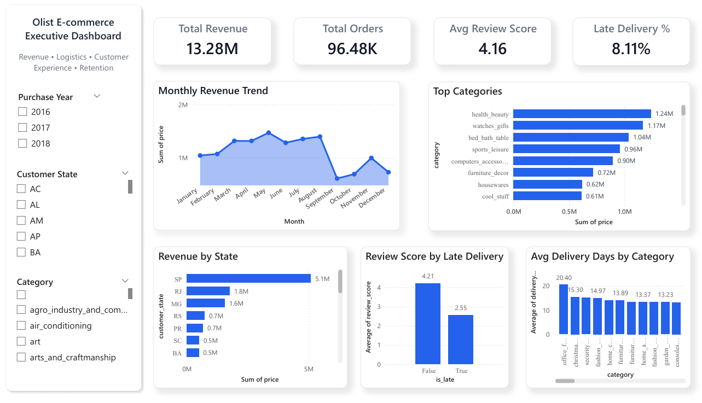

# Olist E-commerce Executive Dashboard

## Project Overview

This project analyzes a real-world e-commerce marketplace dataset provided by Olist, a Brazilian online retail platform. The objective was to evaluate business performance across revenue, logistics, customer satisfaction, and retention using data analysis and dashboarding techniques.

An interactive Power BI dashboard was developed to help stakeholders monitor key metrics, identify operational issues, and support decision-making.

---

## Business Objectives

The project focused on answering the following business questions:

- What are the major revenue-driving product categories?
- How has monthly revenue changed over time?
- Which regions generate the highest sales?
- What percentage of deliveries are late?
- How do delivery delays impact customer review scores?
- How strong is customer retention and repeat purchase behavior?

---

## Dataset

**Source:** Olist Brazilian E-commerce Public Dataset

The dataset contains transactional marketplace data including:

- Customers
- Orders
- Order Items
- Payments
- Products
- Sellers
- Reviews
- Geolocation

The data includes over 99,000 orders and multiple relational tables representing marketplace operations.

---

## Tools Used

- Python
- Pandas
- NumPy
- Matplotlib
- Seaborn
- Power BI

---

## Data Preparation

The raw datasets were cleaned and transformed in Python before being used in Power BI.

Key preparation steps:

- Merged multiple tables into a flat analytical dataset
- Converted timestamps into datetime format
- Calculated delivery duration
- Created late delivery flag
- Extracted month and year fields
- Standardized category names using translation mapping
- Removed incomplete records where necessary

---

## Dashboard Features

### KPI Cards

- Total Revenue
- Total Orders
- Average Review Score
- Late Delivery Percentage

### Visualizations

- Monthly Revenue Trend
- Top Revenue Categories
- Revenue by State
- Review Score by Delivery Status
- Average Delivery Days by Category

### Filters

- Purchase Year
- Customer State
- Product Category

---

## Key Insights

### Revenue Performance

- Health & Beauty was the highest revenue-generating category.
- Watches & Gifts and Bed Bath Table were also major contributors.
- Revenue showed strong growth patterns with seasonal fluctuations.

### Logistics Performance

- 8.11% of delivered orders were late.
- Certain categories such as Audio and Electronics showed higher delay rates.

### Customer Satisfaction

- On-time deliveries had an average review score of 4.29.
- Late deliveries had an average review score of 2.57.

This indicates a strong relationship between logistics performance and customer experience.

### Retention

- Approximately 97% of customers made only one purchase.
- Repeat customers represented only 3% of the customer base.

This suggests strong acquisition but weak retention.

---

## Business Recommendations

### Improve Delivery Performance

- Prioritize delayed high-volume categories.
- Optimize carrier performance and fulfillment timelines.
- Proactively communicate delays to customers.

### Increase Retention

- Introduce loyalty and repeat purchase incentives.
- Launch personalized post-purchase remarketing campaigns.

### Grow Revenue

- Increase focus on top-performing categories.
- Bundle complementary products for repeat purchases.

---

## Dashboard Preview

